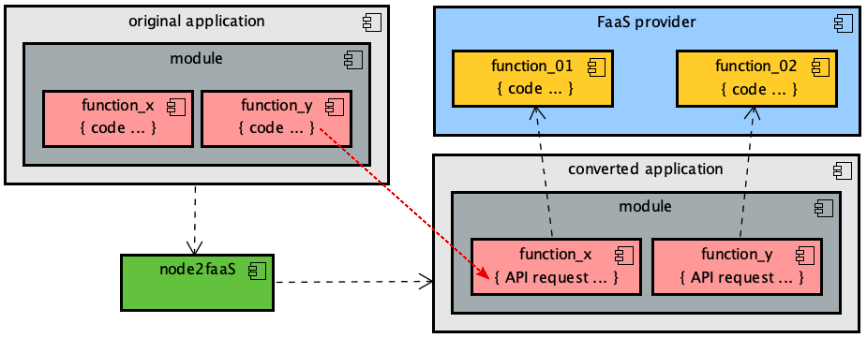
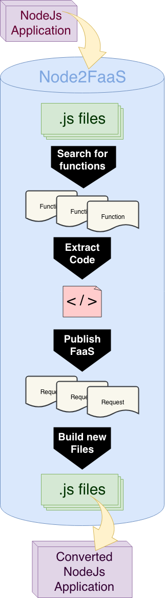

# Node2FaaS Framework

### Node Applications conversor to Function as a Service (FaaS) Deployments.

## Pre-Requisites

To use this conversor you need to have an active account in some FaaS provider like Amazon AWS Lambda.

## Purpose

This framework intend to help NodeJS developers to migrate from monolith model to function as a service (serverless) model. It parses the original code looking for exported functions and create a equivalent function on the provider. Instead of the original function is placed a restAPI request to FaaS. 

## Workflow



## Convertion Process



## Installation

```npm install node2faas```

or

```git clone https://github.com/leonardoreboucas/node2faas.git```

```cd node2faas```

```npm link```

## Usage

- Anotate any function to be skipped in original with **//@node2faas-skip** imediately before function definition

- Run: ```node2faas [/path/to/original/application]```

- Folow de app instructions

- After proccess, check the directory *output*, your application converted to work with FaaS will be there.

## Features

- Convert only .js files (other kinds are skipped)
- Store provider credentials after first execution (don't ask again)
- Creates new FaaS function on the choosed provider
- Creates all provider API Gateway resources

## Limitations

- Providers:
	- AWS Lambda (OK)
	- *Microsoft Azure (under construction)*
	- *Google Functions (under construction)*
- Function types:
	- exported (OK)
		- Ex: ```exports.functionName = function(params) { ... } ``` 
	- *local (under construction)* 
		- Ex: ```functionName(params) { ... } ``` 

## Examples

This project contains some examples to guide you. Look inside example folder.

#### Load example

The load example explores 4 potencial function loads:
 - Simple -> only some calculate process
 - Memory -> process with high memory consumption
 - CPU -> process with high CPU consumption
 - I/O -> process with high I/O consumption

 There are 2 versions of this example application. The original one, that is monolith, and the converted one, using FaaS requests. The converted application contains requests that is not available and it is only for examplification. Try use the load_not_converted application to explore the framework potential.

 ```node2faas examples/load_not_converted```


## Support

If you need more information, send a message to: leouesb@gmail.com
